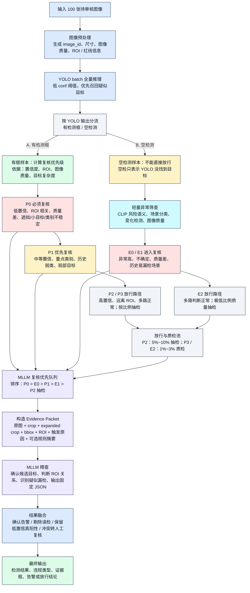

# YOLO 与 MLLM 在线协同推理流程图

目标：在 `100 张 <= 60s` 约束下，优先保证综合检出率和最终判定准确率。

```mermaid
flowchart TD
    A["输入 100 张待审核图像"]
    B["图像预处理<br/>生成 image_id、尺寸、图像质量、ROI / 红线信息"]
    C["YOLO batch 全量推理<br/>低 conf 阈值，优先召回疑似目标"]
    D["按 YOLO 输出分流<br/>有检测框 / 空检测"]

    A --> B --> C --> D

    D -->|A. 有检测框| E["有框样本：计算复核优先级<br/>依据：置信度、ROI、图像质量、目标复杂度"]
    E --> F["P0 必须复核<br/>低置信、ROI 相关、质量差、遮挡/小目标/类别不稳定"]
    F --> G["P1 优先复核<br/>中等置信、重点类别、历史弱类、局部目标"]
    G --> H["P2 / P3 放行路径<br/>高置信、远离 ROI、多路正常；按比例抽检"]

    D -->|B. 空检测| I["空检测样本：不能直接放行<br/>空检只表示 YOLO 没找到目标"]
    I --> J["轻量异常筛查<br/>CLIP 风险语义、场景分类、变化检测、图像质量"]
    J --> K["E0 / E1 进入复核<br/>异常高、不确定、质量差、历史易漏检场景"]
    K --> L["E2 放行路径<br/>多路判断正常；极低比例质量抽检"]

    F --> M["MLLM 复核优先队列<br/>排序：P0 > E0 > P1 > E1 > P2 抽检"]
    G --> M
    K --> M

    H --> N["放行与质检池<br/>P2：5%~10% 抽检；P3 / E2：1%~3% 质检"]
    L --> N
    N --> M

    M --> O["构造 Evidence Packet<br/>原图 + crop + expanded crop + bbox + ROI + 触发原因 + 可选规则摘要"]
    O --> P["MLLM 精查<br/>确认候选目标、判断 ROI 关系、识别疑似漏检、输出固定 JSON"]
    P --> Q["结果融合<br/>确认告警 / 剔除误检 / 保留低置信真阳性 / 冲突转人工复核"]
    Q --> R["最终输出<br/>检测结果、违规类型、证据框、告警或放行结论"]

    classDef main fill:#dbeafe,stroke:#334155,color:#111827;
    classDef normal fill:#f1f5f9,stroke:#334155,color:#111827;
    classDef ok fill:#dcfce7,stroke:#334155,color:#111827;
    classDef warn fill:#fef3c7,stroke:#334155,color:#111827;
    classDef danger fill:#fee2e2,stroke:#334155,color:#111827;
    classDef ml fill:#ede9fe,stroke:#334155,color:#111827;
    classDef check fill:#cffafe,stroke:#334155,color:#111827;

    class A,B,C,Q main;
    class D,H,L,N normal;
    class E,R ok;
    class I,G warn;
    class F,K danger;
    class M,O,P ml;
    class J check;
```

注：本图只描述在线推理交互链路，不包含数据标注、YOLO 训练、Active Learning 或伪标签流程。
